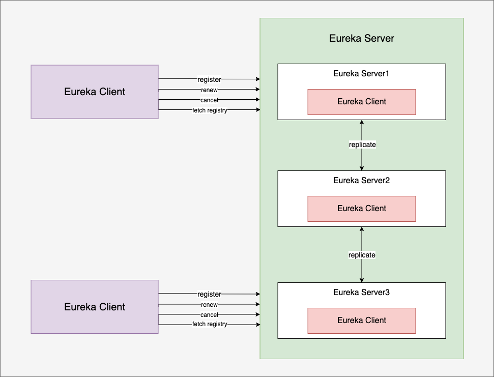
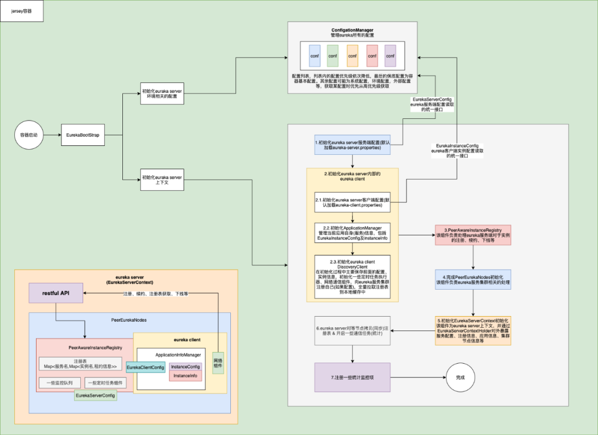
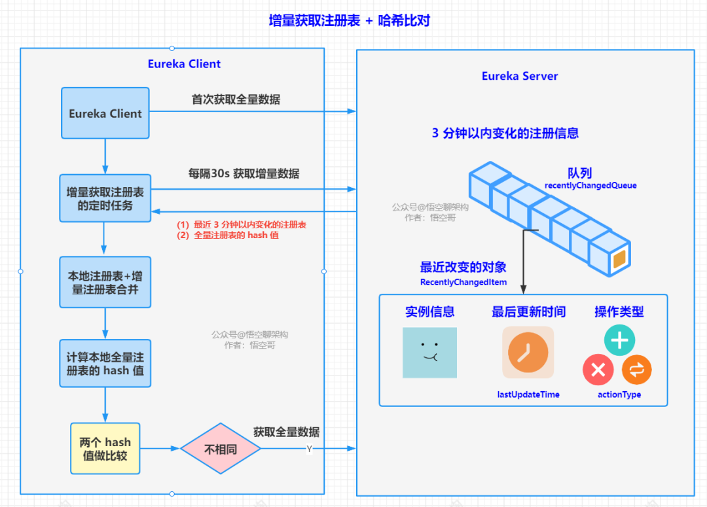
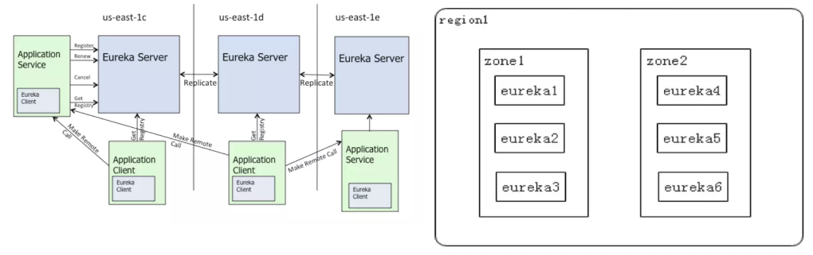

## 笔记&摘抄

### [1. Eureka 架构](https://mp.weixin.qq.com/s?__biz=MzUxOTE5MTY4MQ==&mid=2247486023&idx=1&sn=9694060f60bfbad667b8573c8af74c55&chksm=f9fc27a9ce8baebf4810670892f18ba87e46948667530d331f5302a7d6f249bef0c879d8c3df&scene=178&cur_album_id=1378901852963864576#rd)
    
1.1 eureka server 是运行在 web 容器(jersey，类似于 tomcat)，基于 restful 接口对外提供入口 1

1.2 eureka server 可以集群部署，并且 eureka server 本身既是服务端也是客户端，集群之间的注册表会进行同步 

1.3 eureka 保存有所有向其注册的客户端实例的租约信息，并提供维护 

1.4 eureka server 对外提供一系列 http 接口包括服务注册、续约、下线、获取注册表、获取注册表增量、获取应用及实例等接口，eureka client 利用底层的网络组件同 eureka serevr 通过这些接口实现网络通信，进而实现服务注册、发现、下线、更新注册表等。

1.5


1.6


### [2. Eureka 源码解析](https://mp.weixin.qq.com/mp/appmsgalbum?__biz=MzAwMjI0ODk0NA==&action=getalbum&album_id=2083392961806925826&scene=173&from_msgid=2451961268&from_itemidx=1&count=3&nolastread=1#wechat_redirect)

2.1 自我保护机制开关
```
eureka.server.enable-self-preservation = false
```
该模式被激活后，它不会从注册列表中剔除因长时间没收到心跳导致租期过期的服务，而是等待修复，直到心跳恢复正常之后，它自动退出自我保护模式。  
这种模式旨在避免因网络分区故障导致服务不可用的问题。   
例如：两个客户端实例 C1 和 C2 的连通性是良好的，但是由于网络故障，C2 未能及时向 Eureka 发送心跳续约，这时候 Eureka 不能简单的将 C2 从注册表中剔除。因为如果剔除了，C1 就无法从 Eureka 服务器中获取 C2 注册的服务，但是这时候 C2 服务是可用的。

[Eureka 的自我保护机制和服务摘除机制](https://mp.weixin.qq.com/s?__biz=MzAwMjI0ODk0NA==&mid=2451961128&idx=1&sn=3e2c399aa8ac70d9bdd2df04ccca61db&chksm=8d1c0cb7ba6b85a12de93d1767a6f67e0c1522632c47ae60dae43b42807979875d4b01a90f13&cur_album_id=2083392961806925826&scene=190#rd) ：
1. Eureka 心跳机制：每个服务每隔 30s 自动向 Eureka Server 发送一次心跳，Eureka Server 更新这个服务的最后心跳时间。如果 180 s 内（版本1.7.2）未收到心跳，则任务服务故障了。
2. Eureka 自我保护机制：如果上一分钟实际的心跳次数，比我们期望的心跳次数要小，就会触发自我保护机制，不会摘除任何实例。期望的心跳次数：服务实例数量 * 2 * 0.85。
3. Eureka 服务摘除机制：不是一次性将服务实例摘除，每次最多随机摘除 15%。如果摘除不完，1 分钟之后再摘除。

自我保护机制触发后 eureka 页面提示：EMERGENCY! EUREKA MAY BE INCORRECTLY CLAIMING INSTANCES ARE UP WHEN THEY'RE NOT. RENEWALS ARE LESSER THAN THRESHOLD AND HENCE THE INSTANCES ARE NOT BEING EXPIRED JUST TO BE SAFE.

2.2 注册信息结构

```ConcurrentHashMap<String, Lease<InstanceInfo>> gNewMap```

key 就是一个 唯一 id，String 类型。值类似这种：i-00000004  
value 里面存的是 Lease。  
Lease是一个类，里面持有一个 instanceInfo 的 holder。这个 instanceInfo 就是注册过来的服务实例信息，包含  ip 地址，端口号等。

此map的操作采用了读写锁

2.3 注册信息缓存的读取逻辑 

首先默认会先从只读缓存 readOnlyCacheMap 里面找。  
没有的话，再从读写缓存 readWriteCacheMap 里面找。  
找到了的话就更新只读缓存，并返回找到的缓存。  
还找不到的话，就返回空。  

[三层缓存架构](https://mp.weixin.qq.com/s?__biz=MzAwMjI0ODk0NA==&mid=2451960953&idx=1&sn=4c420631fec5707334739bdb431038fd&chksm=8d1c0de6ba6b84f073149d6b0067a3ac0fd5373463e1b4d50fbb64500d8cdba68fa9d7375b69&cur_album_id=2083392961806925826&scene=190#rd)  
一级缓存：只读缓存 readOnlyCacheMap，数据结构 ConcurrentHashMap。相当于数据库。  
二级缓存：读写缓存 readOnlyCacheMap，Guava Cache。相当于 Redis 主从架构中主节点，既可以进行读也可以进行写。  
三级缓存：本地注册表 registry，数据结构 ConcurentHashMap。相当于 Redis 主从架构的从节点，只负责读。  

缓存相关开关：
1. eureka.server.useReadOnlyResponseCache : 是否开启只读缓存，如果为 false，则直接从读写缓存获取。默认为 true。
2. eureka.server.responseCacheUpdateIntervalMs : 定时更新只读缓存的间隔时间，默认每隔 30 秒将读写缓存更新的缓存同步到只读缓存。

2.4 [客户端增量拉取](https://mp.weixin.qq.com/s?__biz=MzAwMjI0ODk0NA==&mid=2451960740&idx=1&sn=9bc3345841c78faa9dfcbcb2cb5cd584&chksm=8d1c0a3bba6b832dc9db10d7480fefc70602835b8cb2ee7324ae920744da546b6a8bb154c97c&cur_album_id=2083392961806925826&scene=190#rd)

客户端每隔 30s 获取一次增量数据，注册中心返回最近 3 分钟变化的注册信息，包含了新注册的、更新的和下线的服务实例。然后将增量注册表 + 全量注册表的 hash 值返回。

客户端将本地注册表 + 增量注册表进行合并。合并完成后，计算一个 hash 值，和 Server 返回的 hash 值进行比对，如果相等，则说明客户端的注册表和注册中心的注册表一致，同步完成。如果不一致，则还需要全量拉取一次。

为什么 hash 比对会不一致？   
如果客户端因为网络故障下线了，上一次最近 3 分钟的增量数据没有拉取到，那么相当于丢失了一次增量数据，这个时候，就不是完整的注册表信息了。

### 3. [Eureka的自我保护机制](https://www.jdon.com/springcloud/eureka-self-preservation.html)

假设某个时间点的已注册应用程序实例数为N，配置renewal-percent-threshold为0.85。

* 一个实例预期的心跳数/ 分钟= 2
* N个实例预期的心跳数/分钟= 2 * N.
* 预期最小心跳/ 分钟 = 2 * N * 0.85

由于N是变量，因此默认情况下每15分钟计算一次2 * N * 0.85结果。或基于renewal-threshold-update-interval-ms的设置时间计算。

### 4. [](https://www.techgrow.cn/posts/be1e11c7.html)

4.1 Eureka 的自我保护模式  
默认情况下，如果 Eureka Server 在一定时间内（默认 90 秒）没有接收到某个微服务实例的心跳，Eureka Server 将会注销该实例。但是当网络分区故障发生时，微服务与 Eureka Server 之间无法正常通信，这就可能变得非常危险了。因为微服务本身是健康的，此时本不应该注销这个微服务。Eureka Server 通过 “自我保护模式” 来解决这个问题，当 Eureka Server 节点在短时间内丢失过多客户端时（超过 85% 的服务实例丢失心跳，可能发生了网络分区故障），那么这个节点就会进入自我保护模式。一旦进入该模式，Eureka Server 就会保护服务注册表中的信息，不再删除服务注册表中的数据（也就是不会注销任何微服务）。当网络故障恢复后，该 Eureka Server 节点会自动退出自我保护模式。自我保护模式是一种对网络异常的安全保护措施，使用自我保护模式，可以让 Eureka 集群更加的健壮、稳定。

在自我保护模式中，Eureka Server 会保护注册表中的信息，不再注销任何服务实例。当它收到的心跳数重新恢复到阀值以上时，该 Eureka Server 节点就会自动退出自我保护模式。它的设计哲学就是宁可保留错误的服务注册信息（健康或不健康的微服务都会保留），也不盲目注销任何可能健康的服务实例。在 Spring Cloud 中，可以使用 eureka.server.enable-self-preservation: false 来禁用自我保护模式。

4.2 Eureka 自我保护模式的效果   
Eureka 不再从注册列表移除因长时间没收到心跳而应该过期的服务
Eureka 仍然能够接受新服务的注册和查询请求，但是不会被同步到其他节点（高可用）
Eureka 在网络稳定的时候，当前实例新的注册信息会被同步到其他节点中（最终一致性）
Eureka 可以很好的应对因网络故障导致部分节点失去联系的情况，而不会像 ZooKeeper 一样使得整个注册中心瘫痪

4.3 Netflix 在 AWS 中的 Eureka 部署架构

上图（左边）描述的是 Netflix 在 AWS 中的 Eureka 部署架构，图中的 us-east-1x 指的是不同的 zone。AWS 将服务划分成不同地区（region），每个 region 中又有若干个机房（zone），结构图大致上图（右边）所示，每个 zone 都是一个 Eureka 集群，其中至少有一台 Eureka Server，用来处理 zone failure。在 Eureka 中注册的服务每隔 30s 会向服务端发送一次心跳，用来告知服务端自己是否” 存活”，这个过程就是图中的 renew；如果 renew 操作在重试几次后都没有成功，那这个服务在 90s 之内就会被踢除。需要注意的是，renew 信息和服务注册信息会在多个 zone 间同步，任何一个 zone 中的客户端都可以寻找到任意一个 zone 中注册的服务信息。

### 5. --